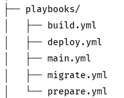
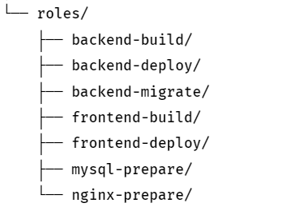

# Repository Penugasan Kedua OPREC AJK 2024 [Ansible]

## By: Muhammad Bimatara Indianto / 5025221260

## Deskripsi Penugsana Kedua 

Pada penugasan kedua, Camin diharuskan untuk mencoba mendeploy suatu _Web Service_ baik dari segi _Back-End_ maupun _Front-End_ menggunakan **_Ansible_**. Tujuan utama dari penugasan ini adalah bagaimana setelah script ansible ini dijalankan _Web Service_ dapat di tampilkan.

### Repository Source:
- [Front End Repository](https://github.com/elshiraphine/fe-todo) 
- [Back End Repository](https://github.com/elshiraphine/be-todo)

## How to solve?

Referensi saya dalam mengerjakan penugasan kedua kali ini adalah [Pelatihan Ansible](https://github.com/arsitektur-jaringan-komputer/modul-ansible) dan juga [Pelatihan Deployment](https://github.com/arsitektur-jaringan-komputer/modul-deployment). Terdapat 4 Playbooks yang harus dilengkapi dalam mengerjakan penugasan ini dan dijalankan pada playbooks kelima yaitu `main.yml`. Struktur direktory dari playbooks seperti berikut. 



Selain itu juga terdapat struktur direktori untuk roles yang telah disiapkan oleh para admin dan harus dibuat untuk base directory masing masing roles. Struktur directory roles sebagai berikut. 




Untuk membuat masing masing roles saya menggunakan command: `ansible-galaxy init <role-name>`

Pada [main.yml](./playbooks/main.yml), saya menjalankan keempat playbooks lainnya dengan cara mengimport masing masing playbooks dengan urutan sebagai berikut. 
- prepare.yml
- build.yml
- migrate.yml
- deploy.yml

Berikut merupakan cara saya mengimport masing masing playbooks ke dalam main. 

```yml
- import_playbook: prepare.yml
- import_playbook: build.yml
- import_playbook: migrate.yml
- import_playbook: deploy.yml

- name: Running All Playbooks
  hosts: all
  become: true
```

Pada playbooks [prepare.yml](./playbooks/prepare.yml), saya melakukan running pada roles `nginx-prepare` dan juga `mysql-prepare`
dengan cara sebagai berikut. 

```yml
- name: Running nginx-prepare
  hosts: all
  become: true
  roles: 
    - roles/nginx-prepare
    - roles/mysql-prepare
```

Kemudian pada playbooks [build.yml](./playbooks/build.yml), saya melakukan running pada roles `backend-build` dan juga `frontend-build`
dengan cara sebagai berikut. 

```yml
- name: Running Build Playbooks
  hosts: all
  become: true
  roles: 
    - roles/backend-build
    - roles/frontend-build
```

Kemudian pada playbooks [migrate.yml](./playbooks/migrate.yml), saya melakukan running pada roles `backend-migrate` dengan cara sebagai berikut. 

```yml
- name: Running Migrate Playbooks
  hosts: all
  become: true
  roles: 
    - roles/backend-migrate
```

Kemudian pada playbooks [deploy.yml](./playbooks/deploy.yml), saya melakukan running pada roles `backend-deploy` dan juga `frontend-deploy`
dengan cara sebagai berikut. 

```yml
- name: Running Deploy Playbooks
  hosts: all
  become: true
  roles: 
    - roles/backend-deploy
    - roles/frontend-deploy 
```
